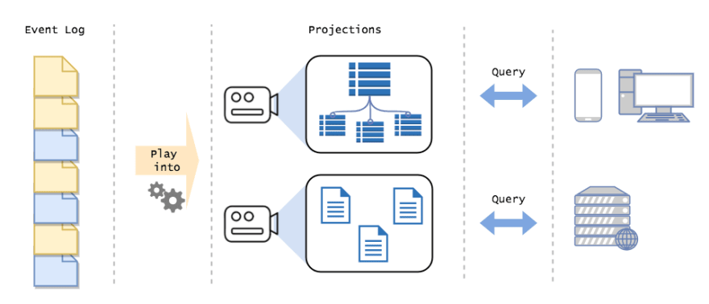

# AKKA CQRS projections
The gist of this exercises is to get familiar with event sourcing and projections through [akka persistence](https://doc.akka.io/docs/akka/current/typed/persistence.html)

This assumes some familiarity with Akka Typed (at least what a Behavior is). And also a vague idea of what problem event sourcing and akka persistence try to solve.

In a nutshell we could say that after having some persisted actor events in a journal. We'd like to consume those events
a form a view out of it. Generally we would use the name projection. e.g. We have multiple event from our Box entity, 
namely the elements that have been added, and we'd like to read all this event's and put them in a table so we can
query directly how many items have this Box. 

This projection have two main benefits. Performance and flexibility. We are not hitting the original journal so we can scale the readers without compromising the writing. And also we are free to define the format of our projection to align with an specific query with do not have to know before the fact.  

This exercises build upon some knowledge from [akka-persistence-training](https://github.com/franciscolopezsancho/akka-persistence-training/). An the code starts with essentially the same code that workshops ends with. 

Let's get started

The working method is, I hope, very simple. Just open you favorite IDE in the exercise folder you'd like to work
on. There's you'll find a README.md with the task at hand while the solution can be found in the next exercise. As each
exercise start where the previous one it's supposed to end. The last exercise will have its solution in
the folder with the same name but with 'solution' in the name instead of 'exercise'

The exercises are the following

   1. reading from the journal : Events are persisted in a storage and we'd like to read them
   2. write to a projection : After reading those events we want to push them to another table, our 'projection'
   3.  Automate testing : Once we see we are actually writing in our projection table we will automate a test to prove that
   4. Refactor : Previous steps should be done in the test itself, and not suprisingly refactor is recommended to be done over working tests. So now let's pull out a couple of classes. A DBFactory and a Projector.
   5.  Adding tags : A tag is a way of filtering elements and while previously we were just getting the ids of the entities, now we are going to get the events tagged with `Box` in them.
   6.  Adding tags to parallelize reading : We'll create different tags depending on the id f the `Box` so then when consuming from the database different reader have to consume from different tables/projections.
   7. Adding tags by event: Finally we'll filter events not only by entity but by event types, we'll create a new event called `BoxCleaned` and we'll try to consume them from the journal to create and specific projection for this type of events.